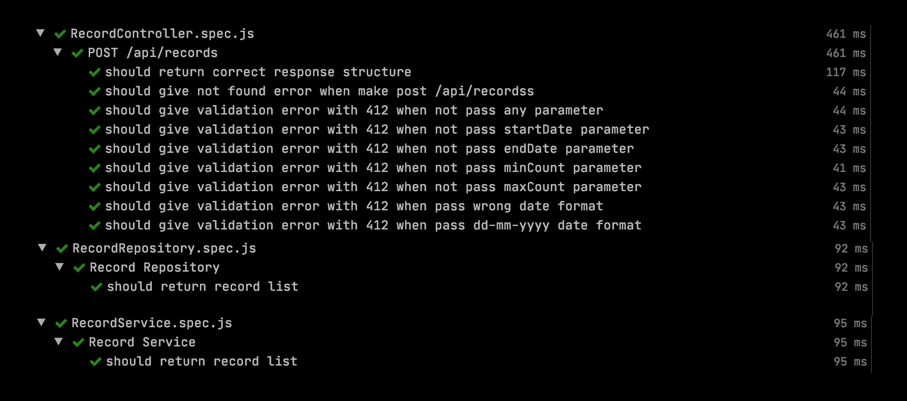

# Welcome to getir case study rest api documentation


This application is a technical test project for senior backend software engineer role of [Getir](https://www.getir.com). 

Before start you can access backend rest api online from [here](https://akin-gundogdu-getir-case-study.herokuapp.com). 

# Prerequisites

>Before we begin, make sure you have [NodeJs] version >=12.* and [Express] version ^4.17.1.


```sh
$ node -v # node v12.10.0
$ express --version # Express 4.16.1
```


### Npm
As you know Nodejs utilizes [npm] to manage its dependencies. So, before starting setup our app, make sure you have [npm] installed on your machine.

You can check if you have 
```sh
$ which npm
```

To update to its latest version with:

```sh
$ npm update --system
```

# Project Setup

First step, we need to clone rest api repo to your local machine.
```sh
$ git clone https://github.com/akingundogdu/getir-case-study.git
```
After that, go to inside directory your cloned path and running this command.
```sh
$ npm install
```
### Dependencies
Let's take a moment to review the npms that we used.

  - [Express] - Fast, unopinionated, minimalist web framework for Node.js.
  - [dotenv](https://www.npmjs.com/package/dotenv) - Dotenv is a zero-dependency module that loads environment variables from a .env file into process.env. Storing configuration in the environment separate from code is based on The Twelve-Factor App methodology.
  - [express-validator](https://express-validator.github.io/docs) - express-validator is a set of express.js middlewares that wraps validator.js validator and sanitizer functions.


  - [mongoose](https://mongoosejs.com) - Mongoose provides a straight-forward, schema-based solution to model your application data. It includes built-in type casting, validation, query building, business logic hooks and more, out of the box.
  - [jest](https://jestjs.io) - Jest is a delightful JavaScript Testing Framework with a focus on simplicity.
  - [mongodb-memory-server](https://www.npmjs.com/package/mongodb-memory-server) - Spinning up mongod in memory for fast tests. If you run tests in parallel this lib helps to spin up dedicated mongodb servers for every test file in MacOS, *nix, Windows or CI environments (in most cases with zero-config).
  - [nodemon](https://nodemon.io/) - Nodemon is a utility that will monitor for any changes in your source and automatically restart your server. Perfect for development. Install it using npm.


  - [swagger-node-express](https://www.npmjs.com/package/swagger-node-express) - This is a Swagger module for the Express web application framework for Node.js.
  - [express-swagger-generator](https://www.npmjs.com/package/express-swagger-generator) - This is a Swagger module generator for the Express web application framework for Node.js.
  
### Unit Test

In your root directory, run this command and see all tests are success, like below image

 ```sh
$ jest
```



 
 ### Run Project
For starting serve backend api, just you need to run this command
 ```sh
$ npm run dev or node start.js (without nodemon)
```

All done!

 ### API Details

You can test manually with the link below.

```sh
$ https://akin-gundogdu-getir-case-study.herokuapp.com/api/records
```
| Item | Description |
| --- | --- |
| Uri Base | `https://akin-gundogdu-getir-case-study.herokuapp.com` |
| Route | `api/records` |
| Http Method | `POST` |
| Content-Type | `application/json` |
| Accept | `application/json` |
| Query Parameter | `limit` for pagination |
| Query Parameter | `page` for pagination |
| Body | `{    "startDate": "2016-01-26",    "endDate": "2018-02-02",    "minCount": 2700,    "maxCount": 3000}` |

# Tech

- Nodejs
- ExpressJS
- Javascript
- Ohmzsh
- Postman
- MacOS


### About me
Thanks for reading.

- Author : Akin Gundogdu
- Email : akin-gundogdu@hotmail.com
- Linkedin : https://www.linkedin.co.uk/in/akingundogdu

   [Express]: <https://expressjs.com>
   [Nodejs]: <https://nodejs.org/en>
      [npm]: <https://www.npmjs.com>
